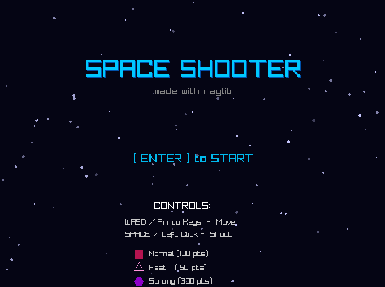
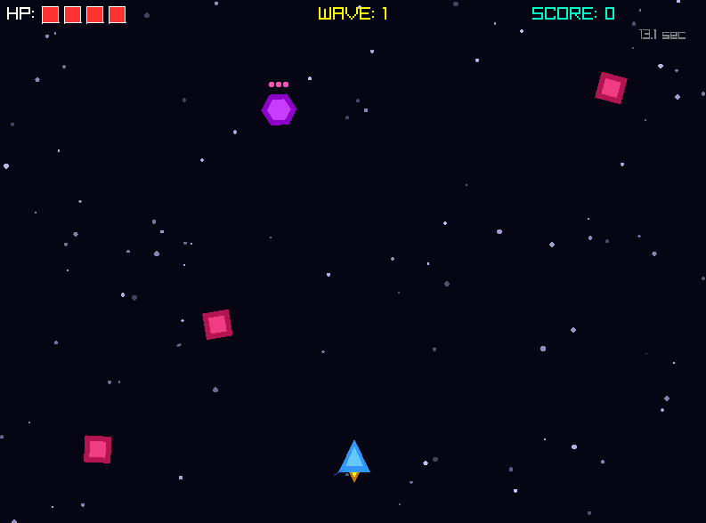
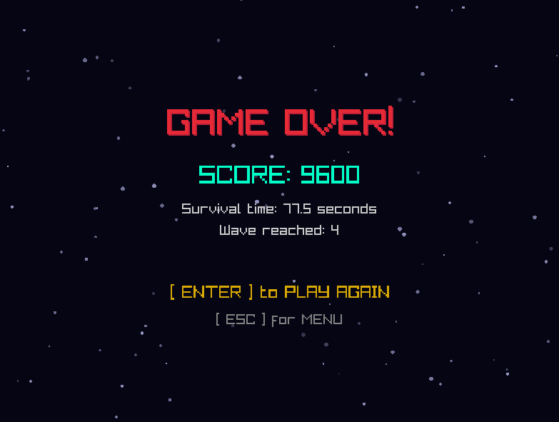

# raylib-space-shooter

A beginner-friendly **2D space shooter game** built with [raylib](https://www.raylib.com/), designed as a hands-on tutorial project. Each system in the codebase is documented as a numbered lesson — making it ideal for anyone learning game development in C.


---



## Preview

```
[ Menu Screen ]          [ Gameplay ]              [ Game Over ]
  SPACE SHOOTER        HP: ♥♥♥♥♥  WAVE: 3        GAME OVER!
  made with raylib     SCORE: 1450                SCORE: 1450
                                                  Wave reached: 3
  [ ENTER ] to START   ▲  ◆  ■  ▲  ◆             Survival: 47.2s
```

---

## Gameplay

- **Survive** endless waves of enemies that get faster and more frequent over time
- **Shoot** them down to earn points before they reach you
- **3 enemy types** with different behaviors and point values:

| Enemy | Shape | Speed | HP | Points |
|-------|-------|-------|----|--------|
| Normal | Red square | Medium | 1 | 100 |
| Fast | Pink triangle | High | 1 | 150 |
| Strong | Purple hexagon | Low | 3 | 300 |

- Difficulty scales automatically every 30 seconds
- Take a hit → 1 second of invincibility
- Lose all 5 HP → game over



---

## Controls

| Input | Action |
|-------|--------|
| `W A S D` or Arrow Keys | Move ship |
| `Space` or Left Click | Shoot |
| `Escape` | Pause / Return to menu |
| `Enter` | Start / Restart |

---



## Building

### Prerequisites

- [raylib 5.x](https://github.com/raysan5/raylib/releases) installed on your system
- GCC or compatible C compiler

### Linux / macOS

```bash
brew install pkgconfig
brew reinstall raylib
git clone https://github.com/gorkemparadise/raylib-space-shooter.git
cd raylib-space-shooter
eval cc main.c $(pkg-config --libs --cflags raylib) -o main
./main
```
---